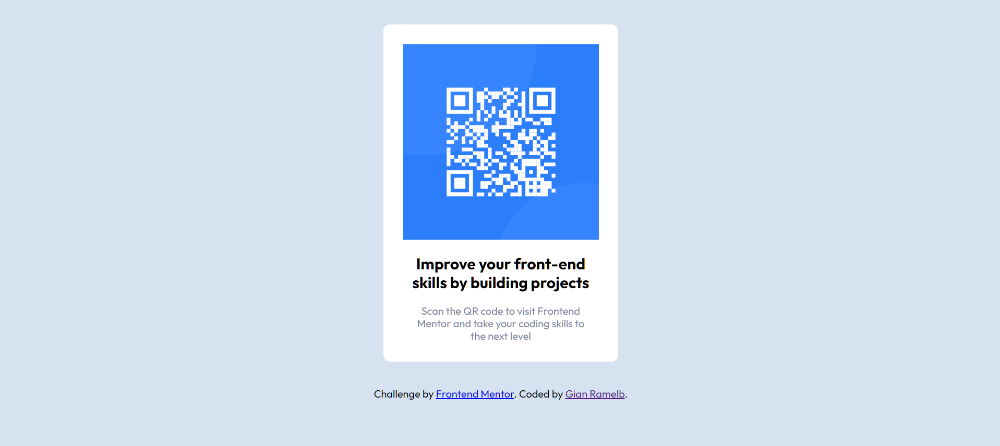

# Frontend Mentor - QR code component solution

This is a solution to the [QR code component challenge on Frontend Mentor](https://www.frontendmentor.io/challenges/qr-code-component-iux_sIO_H). Frontend Mentor challenges help you improve your coding skills by building realistic projects. 

## Table of contents

- [Overview](#overview)
  - [Screenshot](#screenshot)
  - [Links](#links)
- [My process](#my-process)
  - [Built with](#built-with)
  - [What I learned](#what-i-learned)
  - [Continued development](#continued-development)
  - [Useful resources](#useful-resources)
- [Author](#author)
- [Acknowledgments](#acknowledgments)

## Overview

### Screenshot

### Links

- Solution URL: ([https://github.com/rame0033/rame0033.github.io/tree/main/front-end%20mentor%20p1](https://github.com/rame0033/rame0033.github.io/tree/main/front-end_mentor_p1))
- Live Site URL: ([https://rame0033.github.io/front-end%20mentor%20p1/](https://rame0033.github.io/front-end_mentor_p1/))

## My process

### Built with

- Semantic HTML5 markup
- CSS custom properties
- Mobile-first workflow

**Note: These are just examples. Delete this note and replace the list above with your own choices**

### What I learned

I recently finished my web development I course from my college so I tried the first time to use frontend mentor to keep me on track and practice what I've learned. I learned to use comment everytime on my code so that I keep track on which parts I've made and the use of modular scaling for texts instead of pixels.

### Continued development

I believe there are still inconsistencies with my spacing so I keep practicing with the right margins and padding.

### Useful resources

- (https://www.modularscale.com/?1&em&1.5) - This helped me how to use proper font sizing for headings and paragraphs

## Author

- Frontend Mentor - [@rame0033](https://www.frontendmentor.io/profile/rame0033)

