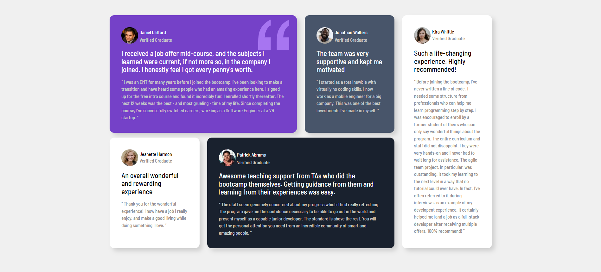

# Frontend Mentor - Testimonials grid section solution

This is a solution to the [Testimonials grid section challenge on Frontend Mentor](https://www.frontendmentor.io/challenges/testimonials-grid-section-Nnw6J7Un7). Frontend Mentor challenges help you improve your coding skills by building realistic projects. 

## Table of contents

- [Overview](#overview)
  - [The challenge](#the-challenge)
  - [Screenshot](#screenshot)
  - [Links](#links)
- [My process](#my-process)
  - [Built with](#built-with)
  - [What I learned](#what-i-learned)
  - [Continued development](#continued-development)
  - [Useful resources](#useful-resources)
- [Author](#author)
- [Acknowledgments](#acknowledgments)

**Note: Delete this note and update the table of contents based on what sections you keep.**

## Overview

### The challenge

Users should be able to:

- View the optimal layout for the site depending on their device's screen size

### Screenshot

### Links

- Solution URL: (https://github.com/rame0033/rame0033.github.io/tree/main/front-end_mentor_p6)
- Live Site URL: (https://rame0033.github.io/front-end_mentor_p6/)

## My process

### Built with

- Semantic HTML5 markup
- CSS custom properties
- CSS Grid
- Mobile-first workflow

### What I learned

I've been doing the grid template areas property since this is the easiest technique for me as of the moment. Just learned also how to put background image on a cell and doing the background position for it. Any feedbacks and suggestions are highly appreciated.

### Continued development
 Still continue learning the property of grid-row and grid column property using span.

### Useful resources

- (https://developer.mozilla.org/en-US/docs/Web/CSS/background-position) - This helped me for doing the background position of the quotation icon.

## Author
- Frontend Mentor - [@rame0033](https://www.frontendmentor.io/profile/rame0033)
