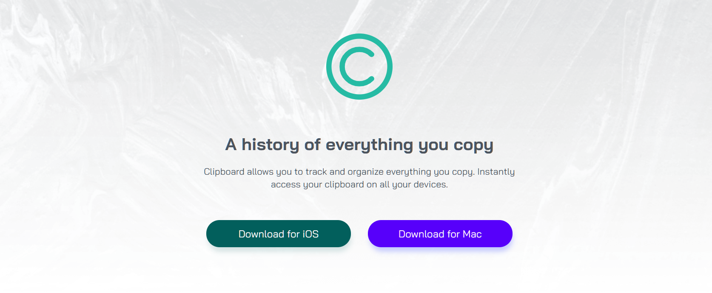
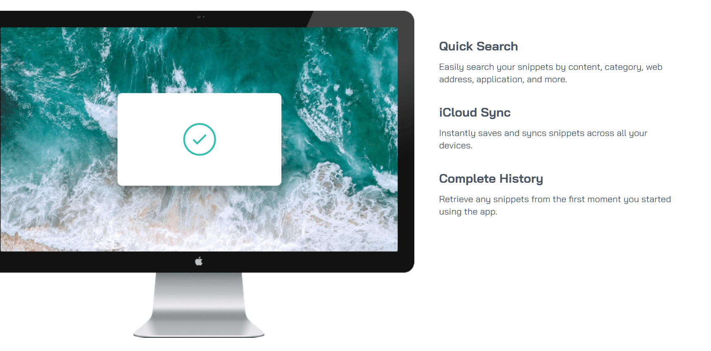

# Frontend Mentor - Clipboard landing page solution

This is a solution to the [Clipboard landing page challenge on Frontend Mentor](https://www.frontendmentor.io/challenges/clipboard-landing-page-5cc9bccd6c4c91111378ecb9). Frontend Mentor challenges help you improve your coding skills by building realistic projects. 

## Table of contents

- [Overview](#overview)
  - [The challenge](#the-challenge)
  - [Screenshot](#screenshot)
  - [Links](#links)
- [My process](#my-process)
  - [Built with](#built-with)
  - [What I learned](#what-i-learned)
  - [Continued development](#continued-development)
  - [Useful resources](#useful-resources)
- [Author](#author)

## Overview

### The challenge

Users should be able to:

- View the optimal layout for the site depending on their device's screen size
- See hover states for all interactive elements on the page

### Screenshot

### Links

- [Solution](https://github.com/rame0033/practice_pages/tree/main/front-end_mentor_p10)
- [Live Site](https://rame0033.github.io/practice_pages/front-end_mentor_p10/)

## My process

### Built with

- Semantic HTML5 markup
- CSS custom properties
- Flexbox

### What I learned

Practicing more on layouts especially on the main section by using the flexbox to place the desktop image on the left most part to display a cropped version of the image.

This is how I do the coding to achieve it

      @media screen and (min-width: 1200px) {
      .featWrap {
        display: flex;
        gap: 1rem;
      }

      .FeatImg {
        margin-left: -3rem;
      }
    }

### Continued development

I acknowledge the goal of the challenge is for optimizing layouts for various screens, and I tried to do accessibility practices as well such as

- Adding skip links
- Adding scale changes on `hover` and `active` states for links
- Contrast between foreground and background colors
- Using ARIA for images and button links

### Useful resources

- [Contrast Checker](https://webaim.org/resources/contrastchecker/?fcolor=990505&bcolor=FFFBE0) - This helped me for checking contrast between my text color and background color.

- [Skip Links](https://www.w3schools.com/accessibility/accessibility_skip_links.php) - This helped me to have an understanding what are skip links for and how to do it.

- [Back To Top Button from Stack Overflow](https://stackoverflow.com/questions/32102747/how-to-make-a-back-to-top-button-using-css-and-html-only) - This is a discussion page that helped me to do a HTML/CSS only Back To Top Button.

- [W3C Decorative Images](https://www.w3.org/WAI/tutorials/images/decorative/) - Article that helped me to give element role for decorative images to hide it from screen-reader.

## Author

- Frontend Mentor - [@rame0033](https://www.frontendmentor.io/profile/rame0033)