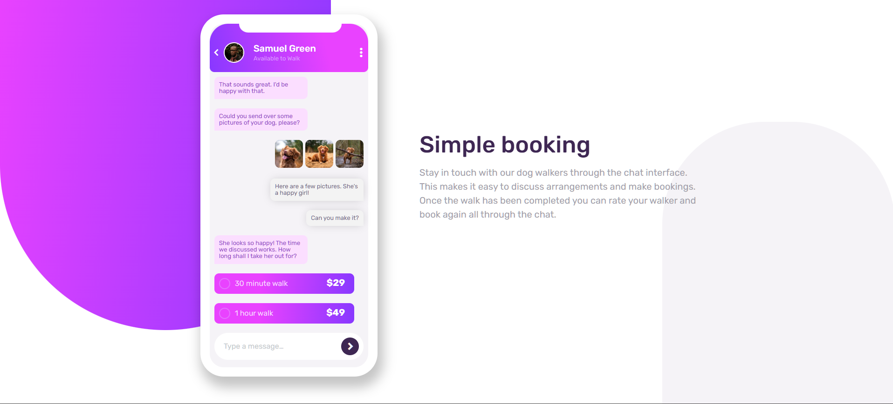

# Frontend Mentor - Chat app CSS illustration solution

This is a solution to the [Chat app CSS illustration challenge on Frontend Mentor](https://www.frontendmentor.io/challenges/chat-app-css-illustration-O5auMkFqY). Frontend Mentor challenges help you improve your coding skills by building realistic projects. 

## Overview

### The challenge

Users should be able to:

- View the optimal layout for the component depending on their device's screen size.

### Screenshot

### Links

- [Solution](https://github.com/rame0033/practice_pages/tree/main/front-end_mentor_p9)
- [Live Site](https://rame0033.github.io/practice_pages/front-end_mentor_p9/)

## My process

### Built with

- Semantic HTML5 markup
- CSS custom properties
- Flexbox
- CSS Grid
- Mobile-first workflow

### What I learned

The use of pseudo-code `::before` and `::after` helped me to add content like accent designs and radio button for the choices in the message container.

The snippet below will show how I did the styling for the mockup radio button

    .time:before {
      content: '';
      display: inline-block;
      height: 1rem;
      width: 1rem;
      border: 0.1rem solid var(--radio-btn);
      border-radius: 50%;
      margin-right: 0.5rem;
    }

## Author
- Frontend Mentor - [@rame0033](https://www.frontendmentor.io/profile/rame0033)

